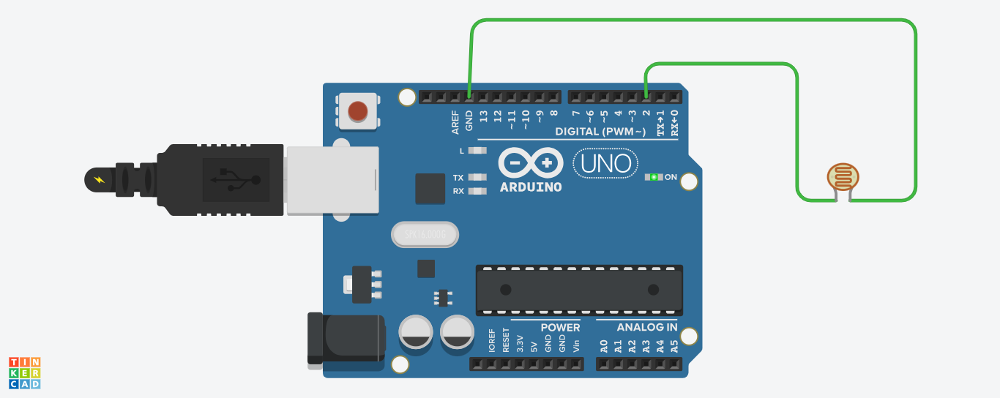

# Real-Time Light Detection System
A beginner embedded systems project demonstraring real-time light detection and visualization using an Arduino Uno, an LDR sensor module and python.
The system monitors ambient light conditions using the LDR module. Arduino processes the sensor input and transmits the data through serial communication, while python visualizes the incoming data in real time using matplotlib.

## Features
- Real-time light detection
- Serial communication between Arduino and python
- live data visualization using matplotlib
- Hardware-software integration
- Beginner embedded systems flow

## Hardware Used
- Arduino Uno
- LDR Sensor Module
- USB cable
- Laptop

## Software & Libraries
### Software 
- Arduino IDE
- python 3

### Python Libraries
- Pyserial
- Matplotlib

## System Workflow
- The LDR sensor detects changes in ambient light
- Arduino reads the sensor state using digital input
- Sensor data is transmitted through serial communication
- Python receives the incoming data
- Matplotlib plots the data in real time

## Project Files
- 'Arduino_code.ino' - Arduino program for sensor monitoring
- 'Serial_plotter.py' - Python script for real-time plotting

## Circuit Diagram

## Screenshots
### Live Plot Output

### Hardware Setup

### Arduino code

## Learning Outcomes
Through this project, i learned:
- Serial communication between Arduino and python
- Real-time data visualization
- sensor interfacing with Arduino
- embedded systems fundamentals
- Hardware-software integration workflows

## Future Improvements
- Add analog light intensity monitoring
- Store sensor data for analysis
- Integrate ESP32 for IoT connectivity
- Add automatic lighting control functionality

## Technologies
- Embedded Systems
- Arduino
- Python
- Matplotlib
- Serial Communication
- IoT Foundations

## Author
Vincent Panyako
Electrical and Communication student|Embedded & IoT Enthusiast

  

